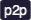

# Contributing to NEO
Neo is an open-source project and it depends on its contributors and constant community feedback to implement the features required for a smart economy. You are more than welcome to join us in the development of Neo.  

Read this document to understand how issues are organized and how you can start contributing.

*This document covers this repository only and does not include community repositories or repositories managed by NGD Shanghai and NGD Seattle.*

### Questions and Support
The issue list is reserved exclusively for bug reports and features discussions. If you have questions or need support, please visit us in our [Discord](https://discord.io/neo) server.  

### dApp Development
This document does not relate to dApp development. If you are looking to build a dApp using Neo, please [start here](https://neo.org/dev).

### Contributing to open source projects
If you are new to open-source development, please [read here](https://opensource.guide/how-to-contribute/#opening-a-pull-request) how to submit your code.

## Developer Guidance
We try to have as few rules as possible,  just enough to keep the project organized:

1.  **Discuss before coding**. Proposals must be discussed before being implemented.  
Avoid implementing issues with the discussion tag.
2. **Tests during code review**. We expect reviewers to test the issue before approving or requesting changes.

3. **Wait for at least 2 reviews before merging**. Changes can be merged after 2 approvals, for Neo 3.x branch, and 3 approvals for Neo 2.x branch.

3. **Give time to other developers review an issue**. Even if the code has been approved, you should leave at least 24 hours for others to review it before merging the code.

4. **Create unit tests**. It is important that the developer includes basic unit tests so reviewers can test it.

5. **Task assignment**. If a developer wants to work in a specific issue, he may ask the team to assign it to himself. The proposer of an issue has priority in task assignment.

### Issues for beginners
If you are looking to start contributing to NEO, we suggest you start working on issues with  or  tags since they usually do not depend on extensive NEO platform knowledge. 

### Tags for Issues States

 Whenever someone posts a new feature request, the tag discussion is added. This means that there is no consensus if the feature should be implemented or not. Avoid creating PR to solve issues in this state since it may be completely discarded.

 When a feature request is accepted by the team, but there is no consensus about the implementation, the issue is tagged with design. We recommend the team to agree in the solution design before anyone attempts to implement it, using text or UML. It is not recommended, but developers can also present their solution using code.  
Note that PRs for issues in this state may also be discarded if the team disagree with the proposed solution.

 Once the team has agreed on feature and the proposed solution, the issue is tagged with ready-to-implement. When implementing it, please follow the solution accepted by the team.

### Tags for Issue Types

 Issues with the cosmetic tag are usually changes in code or documentation that improve user experience without affecting current functionality. These issues are recommended for beginners because they require little to no knowledge about Neo platform.

 Enhancements are platform changes that may affect performance, usability or add new features to existing modules. It is recommended that developers have previous knowledge in the platform to work in these improvements, specially in more complicated modules like the compiler, ledger and consensus.

 New features may include large changes in the code base. Some are complex, but some are not. So, a few issues with new-feature may be recommended for starters, specially those related to the rpc and the sdk module.

 Issues related to the migration from Neo 2 to Neo 3 are tagged with migration. These issues are usually the most complicated ones since they require a deep knowledge in both versions.

### Tags for Project Modules 
These tags do not necessarily represent each module at code level. Modules consensus and compiler are not recommended for beginners.

 Issues that are related or influence the behavior of our C# compiler. Note that the compiler itself is hosted in the [neo-devpack-dotnet](https://github.com/neo-project/neo-devpack-dotnet) repository.

 Changes to consensus are usually harder to make and test. Avoid implementing issues in this module that are not yet decided.

 The ledger is our 'database', any changes in the way we store information or the data-structures have this tag.

 'Small' enhancements that need to be done in order to keep the project organised and ensure overall quality. These changes may be applied in any place in code, as long as they are small or do not alter current behavior.

 Identify issues that affect the network-policy like fees, access list or other related issues. Voting may also be related to the network policy module.

 This module includes peer-to-peer message exchange and network optimisations, at TCP or UDP level (not HTTP).

 All HTTP communication is handled by the RPC module. This module usually provides support methods since the main communication protocol takes place at the p2p module.

 New features that affect the Neo Virtual Machine or the Interop layer.

 Neo provides an SDK to help developers to interact with the blockchain. Changes in this module must not impact other parts of the software. 

 Wallets are used to track funds and interact with the blockchain. Note that this module depends on a full node implementation (data stored on local disk).

