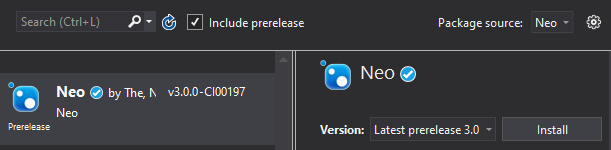

<p align="center">
  <a href="https://neo.org/">
      
  </a>
</p>

<h3 align="center">Neo Blockchain</h3>

<p align="center">
   A modern distributed network for the Smart Economy.
  <br>
  <a href="https://docs.neo.org/docs/en-us/index.html"><strong>Documentation »</strong></a>
  <br>
  <br>
  <a href="https://github.com/neo-project/neo"><strong>Neo</strong></a>
  ·
  <a href="https://github.com/neo-project/neo-vm">Neo VM</a>
  ·
  <a href="https://github.com/neo-project/neo-plugins">Neo Plugins</a>
  ·
  <a href="https://github.com/neo-project/neo-devpack-dotnet">Neo DevPack</a>
  ·
  <a href="https://github.com/neo-project/neo-cli">Neo CLI</a>
</p>
<p align="center">
  <a href="https://twitter.com/neo_blockchain">
      
  </a>
  &nbsp;
  <a href="https://medium.com/neo-smart-economy">
      
  </a>
  &nbsp;
  <a href="https://neonewstoday.com">
      
  </a>
  &nbsp;  
  <a href="https://t.me/NEO_EN">
      
  </a>
  &nbsp;
  <a href="https://www.reddit.com/r/NEO/">
      
  </a>
  &nbsp;
  <a href="https://discord.io/neo">
      
  </a>
  &nbsp;
  <a href="https://www.youtube.com/channel/UCl1AwEDN0w5lTmfJEMsY5Vw/videos">
      
  </a>
  &nbsp;
  <!--How to get a link? -->
  <a href="https://neo.org/">
      
  </a>
  &nbsp;
  <a href="https://weibo.com/neosmarteconomy">
      
  </a>
</p>


## Table of Contents
- [Table of Contents](#table-of-contents)
- [Overview](#overview)
- [Features](#features)
- [Quick Start](#quick-start)
    - [Building a smart-contract](#building-a-smart-contract)
  - [Using source code](#using-source-code)
    - [Using Neo library](#using-neo-library)
    - [Using neo-cli releases](#using-neo-cli-releases)
- [Status](#status)
    - [Reference implementations](#reference-implementations)
    - [Opening a new issue](#opening-a-new-issue)
    - [Bounty program](#bounty-program)
    - [How to contribute](#how-to-contribute)
    - [License](#license)

## Overview
Neo is a blockchain technology built using C# that levereages smart contracts to autonomumously manage digital assets. Using dBFT 2.0 as consensus mechanism, Neo can achieves single block finality in 15 seconds without forking.   
Neo is compatible with .NET Core 3.0 and .NET Standard 2.1.

To learn more about NEO, please read the White Paper:  
- [English](https://docs.neo.org/en-us/whitepaper.html)  
- [白皮书](https://docs.neo.org/zh-cn/whitepaper.html)

*Note: This is Neo 3 branch, currently under development. For the current stable version, please [click here]()*

## Features
These are a few features Neo has:

- **[dBFT2.0](https://medium.com/neo-smart-economy/neos-dbft-2-0-single-block-finality-with-improved-availability-6a4aca7bd1c4)**
  - Single block finality consensus algorithm.
- **[Smart Contracts using C#](https://github.com/neo-ngd/NEO3-Development-Guide/tree/master/en/SmartContract)**
  - Build smart-contracts using C# sintax;
  - Python, Typescript and Go Smart Contracts provided by community projects.
- **[Unity support]()**
  - Neo can be used to create your game in the blockchain.
- **[Neo Blockchain Toolkit for .NET]()**
  - Developer tools, supporting easy smart-contract development with debugging support using Visual Studio Code.
- **[Plugin system]()**
  - Used to extend Neo functinalities, the plugin system allow developers to easily add new features to their nodes.
- **[Native contracts](https://medium.com/neo-smart-economy/native-contracts-in-neo-3-0-e786100abf6e)**
  - Contracts running C# code.
- **[Smart Contract internet access](https://medium.com/neo-smart-economy/on-the-importance-of-oracles-neo-3-0-and-dbft-17c37ee35f32)**
  - Internet acess during a transaction.
- **[Voting Mechanism](https://medium.com/neo-smart-economy/how-to-become-a-consensus-node-27e5317722e6)**
  - Decentralizing control over the network by allowing NEO holders to vote for consensus nodes.
- **[Distributed file-system]()**
  - NeoFS is a scalable, decentralized object storage network integrated with NEO contracts to provide trustless data storage facilities.
- **[Digital identity]()**
  - Using trust, privacy and game theory models. (WIP)


## Quick Start

#### Building a smart-contract
Neo reference implementation offers C# smart-contract support. The code is first compiled to MSIL and subsequentially compiled to a *neo executable file (nef)* 

*Suggestion: Please visit [Neo Blockchain Toolbox](https://github.com/neo-project/neo-blockchain-toolkit) for a complete setup.*

### Using source code
1. Clone https://github.com/neo-project/neo-devpack-dotnet  
2.  Create a new .NET class library solution for your smart-contract.  
3.  Open the project and add   `Neo.SmartContract.Framework.csproj` and `Neo.Compiler.MSIL.csproj` to your solution (inside repo from step 1).   
4.  Add a reference to `Neo.SmartContract.Framework` to your smart-contract project.  
5. Import common used APIs to your project file:
    ```csharp
    using Neo.SmartContract.Framework;
    using Neo.SmartContract.Framework.Services.Neo;
    using Neo.SmartContract.Framework.Services.System;
    ```
6. Extend the SmartContract class and add the entrypoint method:
    ```csharp
    public class Contract : SmartContract
    {
        public static object Main(string operation, object[] args)
        {
            return "Hello World";
        }
    }
    ```

7. Build `Neo.SmartContract.Framework.csproj` project. Check where neon.dll is saved, example:  
    ```
    C:\Users\neo\Workspace\readme-test\neo-devpack-dotnet\src\Neo.Compiler.MSIL\bin\Debug\netcoreapp3.0\neon.dll
    ```
8. Add a post build event to your smart-contract project:

    ```
    dotnet  C:\Users\neo\Workspace\readme-test\neo-devpack-dotnet\src\Neo.Compiler.MSIL\bin\Debug\netcoreapp3.0\neon.dll $(TargetPath)
    ```

9. Verify if the contract was sucessfully compiled:
    ```
    2>gen abi succ
    2>write:contract.nef
    2>write:contract.abi.json
    2>write:contract.manifest.json
    2>SUCC
    ```

#### Using Neo library 
Use this to run a node or send commands to the network.  
This is how you should use Neo. If you can't use C#, consider using RPC endpoints with [neo-cli](https://github.com/neo-project/neo-cli).  


1. Create a new .NET Core Console project;  
2. Add Neo nuget repository reference:
    ```
    https://www.myget.org/F/neo/api/v3/index.json
    ```  
3. Check the `Include Prerelease` checkbox to be able to see Neo 3 packages.  
4. Select and install `Neo` library:

      

5.  Windows - Add `libleveldb.dll` to your project using a pre-compiled version:
    1. Download latest [neo-cli](https://github.com/neo-project/neo-cli/releases/download/v3.0.0-preview1/neo-cli-win-x64.zip) (preview version)  release for Windows.
    2. Extract the files and copy `libleveldb.dll` to your project folder;
    3. Go to Visual Studio and add `libleveldb.dll` to your project;
    4. Open the file properties configure it to be copied to the output folder.  

You can also compile LevelDB from [source](https://github.com/google/leveldb) and add it to your project.  

5. Linux - Install dependencies:
    ```bash
    apt-get update && apt-get install -y \
        libleveldb-dev \
        sqlite3 \
        libsqlite3-dev \
        libunwind8-dev 
    ```

*Visit [neo-cli](https://github.com/neo-project/neo-cli) use case.* 

#### Using neo-cli releases
Neo-cli is a full node with wallet capabilities. It also supports RPC endpoints allowing it to be managed remotely.  

1. Download neo-cli from the release page
2. Run neo-cli executable file
    1. (Optional) Start it with `--rpc` to enable RPC (HTTP endpoints)
4. Start it with `-t` to use testnet configuration  
    ```bash
    dotnet neo-cli.dll -t --rpc
    ```
5. (Optional) If you can't run it using the command line, replace the `protocol.json` file with the `protocol.testnet.json` content to access the testnet.


5. Use `help` to see the command list.


## Status
<p>
  <a href="https://travis-ci.org/neo-project/neo">
    
  </a>
  <a href="https://github.com/neo-project/neo/releases">
    
  </a>
  <a href="https://codecov.io/github/neo-project/neo/branch/master/graph/badge.svg">
    
  </a>
  <a href="https://github.com/neo-project/neo/blob/master/LICENSE">
    
  </a>
</p>


#### Reference implementations
Code references are provided for all platform building blocks. Tha includes the base library, the VM, a command line application and the compiler. Plugins are also included to easily extend Neo functinalities.

* [**neo:**](https://github.com/neo-project/neo/tree/) Neo core library, contains base classes, including ledger, p2p and IO modules.
* [neo-vm:](https://github.com/neo-project/neo-vm/) Neo Virtual Machine is a decoupled VM that Neo uses to execute its scripts. It also uses the `InteropService` layer to extend its functionalities.
* [neo-cli:](https://github.com/neo-project/neo-cli/) Neo Command Line Interface is an executable that allows you to run a Neo node using the command line. 
* [neo-plugins:](https://github.com/neo-project/neo-plugins/) Neo plugin system is the default way to extend neo features. If a feature is not mandatory for Neo functionality, it will probably be implemented as a Plugin.
* [neo-devpack-dotnet:](https://github.com/neo-project/neo-devpack-dotnet/) These are the official tools used to convert a C# smart-contract into a *neo executable file*.

#### Opening a new issue
Please feel free to create new issues in our repository. We encourage you to use one of our issue templates when creating a new issue.  

- [Feature request](https://github.com/neo-project/neo-cli/issues/new?assignees=&labels=&template=bug_report.md&title=)
- [Bug report](https://github.com/neo-project/neo-cli/issues/new?assignees=&labels=&template=bug_report.md&title=)
- [Questions](https://github.com/neo-project/neo-cli/issues/new?assignees=&labels=question&template=questions.md&title=)

If you found a security issue, please refer to our [security policy](https://github.com/neo-project/neo/security/policy).

#### Bounty program
You can be rewarded by finding security issues. Please refer to our [bounty program page](https://neo.org/bounty) for more information.

#### How to contribute
Please read our [contribution guide](https://github.com/neo-project/neo/blob/master/CONTRIBUTING.md).  
The best way to start contributing is by testing open PRs.

#### License
The NEO project is licensed under the [MIT license](LICENSE).