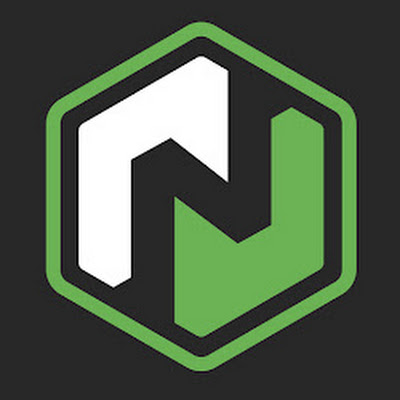

  

<h3 align="center">Neo Blockchain</h3>

   A modern distributed network for the Smart Economy.
   
  <a href="https://docs.neo.org/"><strong>Documentation »</strong></a>
   
   
  <a href="https://github.com/neo-project/neo"><strong>Neo</strong></a>
  ·
  <a href="https://github.com/neo-project/neo-modules">Neo Modules</a>
  ·
  <a href="https://github.com/neo-project/neo-devpack-dotnet">Neo DevPack</a>

  
  &nbsp;
  
  &nbsp;
  
  &nbsp;  
  
  &nbsp;
  
  &nbsp;
  
  &nbsp;
  
  &nbsp;
  <!--How to get a link? -->
  
  &nbsp;
  

  
  
  

  

## Table of Contents
1. [Overview](#overview)
2. [Project structure](#project-structure)
3. [Related projects](#related-projects)
4. [Opening a new issue](#opening-a-new-issue)  
5. [Bounty program](#bounty-program)
6. [License](#license)

## Overview
This repository contain main classes of the 
[Neo](https://neo.org) blockchain.   
Visit the [tutorials](https://docs.neo.org) to get started.

## Project structure
An overview of the project folders can be seen below.

|Folder|Content|
|---|---|
|[/src/neo/Consensus/](https://github.com/neo-project/neo/tree/master/src/Neo/Consensus)| Classes used in the dBFT consensus algorithm, including the `ConsensusService` actor.|
|[/src/neo/Cryptography/](https://github.com/neo-project/neo/tree/master/src/Neo/Cryptography)|General cryptography classes including ECC implementation.|
|[/src/neo/IO/](https://github.com/neo-project/neo/tree/master/src/Neo/IO)|Data structures used for caching and collection interaction.|
|[/src/neo/Ledger/](https://github.com/neo-project/neo/tree/master/src/Neo/Ledger)|Classes responsible for the state control, including the `MemoryPool` and `Blockchain` classes.|
|[/src/neo/Network/](https://github.com/neo-project/neo/tree/master/src/Neo/Network)|Peer-to-peer protocol implementation classes.|
|[/src/neo/Persistence/](https://github.com/neo-project/neo/tree/master/src/Neo/Persistence)|Classes used to allow other classes to access application state.|
|[/src/Plugins/](https://github.com/neo-project/neo/tree/master/src/Plugins)|Interfaces used to extend Neo, including the storage interface.|
|[/src/neo/SmartContract/](https://github.com/neo-project/neo/tree/master/src/Neo/SmartContract)|Native contracts, `ApplicationEngine`, `InteropService` and other smart-contract related classes.|
|[/src/neo/VM/](https://github.com/neo-project/neo/tree/master/src/Neo/VM)|Helper methods used to interact with the VM.|
|[/src/neo/Wallet/](https://github.com/neo-project/neo/tree/master/src/Neo/Wallet)|Wallet and account implementation.|
|[/src/Neo.CLI/](https://github.com/neo-project/neo/tree/master/src/Neo.CLI)| `neo-cli` console application for the running a _FULL_ node.|
|[/src/Neo.Extensions/](https://github.com/neo-project/neo/tree/master/src/Neo.Extensions)| Extensions class to expand the existing functionality.|
|[/src/Neo.Json/](https://github.com/neo-project/neo/tree/master/src/Neo.Json)| Neo's JSON Specification classes.|
|[/src/Neo.VM/](https://github.com/neo-project/neo/tree/master/src/Neo.VM)|Neo base class virtual machine.|
|[/src/plugins/](https://github.com/neo-project/neo/tree/master/src/Plugins)| Include `ApplicationLogs`, `LevelDBStore`, `RpcServer`, `OracleService`, `DBFTPlugin` and more.|
|[/tests/](https://github.com/neo-project/neo/tree/master/tests)|All unit tests.|

## Related projects
Code references are provided for all platform building blocks. That includes the base library, the VM, a command line application and the compiler. 

* [neo:](https://github.com/neo-project/neo/) Included libraries are Neo, Neo-CLI, Neo-GUI, Neo-VM, test and plugin modules.
* [neo-express:](https://github.com/neo-project/neo-express/) A private net optimized for development scenarios.
* [neo-devpack-dotnet:](https://github.com/neo-project/neo-devpack-dotnet/) These are the official tools used to convert a C# smart-contract into a *neo executable file*.
* [neo-proposals:](https://github.com/neo-project/proposals) NEO Enhancement Proposals (NEPs) describe standards for the NEO platform, including core protocol specifications, client APIs, and contract standards.
* [neo-non-native-contracts:](https://github.com/neo-project/non-native-contracts) Includes non-native contracts that live on the blockchain, included but not limited to NeoNameService.

## Opening a new issue
Please feel free to create new issues to suggest features or ask questions.

- [Feature request](https://github.com/neo-project/neo/issues/new?assignees=&labels=discussion&template=feature-or-enhancement-request.md&title=)
- [Bug report](https://github.com/neo-project/neo/issues/new?assignees=&labels=&template=bug_report.md&title=)
- [Questions](https://github.com/neo-project/neo/issues/new?assignees=&labels=question&template=questions.md&title=)

If you found a security issue, please refer to our [security policy](https://github.com/neo-project/neo/security/policy).

## Bounty program
You can be rewarded by finding security issues. Please refer to our [bounty program page](https://neo.org/bounty) for more information.

## License
The NEO project is licensed under the [MIT license](LICENSE).
